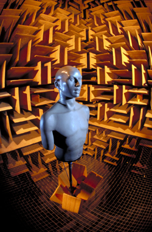
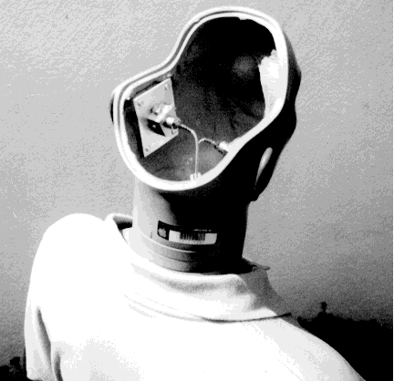

+++
title = "Binaural Audio"
outputs = ["Reveal"]
[reveal_hugo]
theme = "moon"
margin = 0.2
+++

# Binaural Audio

{}
Drawbacks to typical stereo recording practices:

Standard microphone recording formats do not include the binaural cues that we have documented in the previous section. The interaural time differences (ITD) will not be present unless the microphones are placed at a similar distance that the ears are apart. The interaural amplitude differences (IAD) for high frequencies will also be absent since microphones are smaller than the size of the head, and any lack of diffraction around the microphone will be at even higher frequencies. And, of course, pinna colouration will be completely absent. Finally, any effects from the head and torso will also be missing.

One of the reasons that binaural audio is not more popular is because binaural recordings only sound good on headphones, while speaker mixed recordings sound fine on headphones.

It is now possible to create 3D directional sound cues and to synthesise the acoustics of virtual environments quite accurately using digital signal processors (DSP), and it is this area of virtual environment simulation for computer applications that is receiving the most commercial attention for binaural technology today. Flight simulators, computer games, virtual reality applications and architectural auralisation are all areas that are benefiting from these develop- ments. It is also possible to use such technology to synthesise ‘loudspeakers’ where none exist, using binaural cues, as employed in virtual home theatre systems (see below).

{}

---

<iframe width="560" height="315" src="https://www.youtube.com/embed/Yd5i7TlpzCk" title="YouTube video player" frameborder="0" allow="accelerometer; autoplay; clipboard-write; encrypted-media; gyroscope; picture-in-picture" allowfullscreen></iframe>

---

<iframe src="https://apps.voxmedia.com/graphics/theverge-binaural-recording/?initialWidth=1023&childId=binaural-recording__graphic"  width="600" height="600"></iframe>

---

[3D Rain](https://www.pluviophile.com/relaxing-rain-sounds-for-sleeping-binaural-audio/)

---

### Problems with binaural systems

- People’s HRTFs are different (to varying degrees), although there are some common features, making it difficult to generalize about the HRTFs that should be used for commercial systems that have to serve lots of people.
- Head movements that help to resolve directional confusion in natural listening are difficult to incorporate in reproduction situations.

---

- Visual cues are often missing during binaural reproduction and these normally have a strong effect on perception.
- Headphones differ in their equalization and method of mounting, leading to distortions in the perceived HRTFs on reproduction.
- Distortions such as phase and frequency response errors in the signal chain can affect the subtle cues required.

---

## Oscar

{}
Possibly the first example was a mannequin named “Oscar” at Bell Labs which had microphones in the place of ears, but only rudimentary pinnae. Then as now it was tempting to have someone listening via headphones while sounds were made in close proximity to the microphones, just to see how they’d react. However, there was no medium for stereo recording or broadcast at that time, so the experiments didn't lead anywhere.

{}

---

## Neuman Head

<audio src="Kunstkopf.wav" controls>

{}
In the 1960s, the Neumann microphone company in Germany experimented with what they called a kunstkopf, or "artificial head” (popularly know as a “dummy head” with all of the expected humour attached). It modelled the pinnae fairly accurately, and the microphones were placed at the location of the eardrums inside the ear canal. The listener needed to hear the recording on headphones (not speakers) so that there was no second layer of pinna colouration (by passing over the listener’s pinnae again).

{}

---

## Above the head

Left to right trajectory around an artificial head, then front centre to above the head. Source: Cook 26

<audio src="Cook-Elevation.wav" controls>

{}
Neumann researchers experimented with adding a torso which contributed some nuances to the realism, but experiments with adding hair were a predictable failure. The main problem with binaural recording seems to be to get a well-defined frontal image where the pinna colourations need to be precise. Of course, if a trajectory path is suggested, then the listener will likely hear it passing in front, with possibly a slight rise in the middle. Going over the head is also a tricky image to sustain, as in this example, first left to right (quite good) then from centre to above the head (a bit more problematic).
{}

---

## Duda recordings

{}
Some of the best binaural recordings are those made by Richard Duda at San Jose State University in California, in his lab equipped with a Kemar artificial head. The Kemar includes a modelled torso, and accurate pinnae.

{}

---

- Moving from a reverberant room to an anechoic chamber
  - <audio src="Duda14-Anechoic.wav" controls>
- Binaural cues in the frontal plane (left, above, right, below)
  - <audio src="Duda47-Vertical plane.wav" controls>

---

- Music in 3 examples: Left track mono; Right track mono; binaural
  Check out the clarinet over your right shoulder!
  - <audio src="Duda4-LRBin.wav" controls>
- Passing jet in 3 examples: Normal stereo; Low-bandwidth binaural; High-bandwidth binaural; Which gives the best impression of the jet being overhead? Source: Duda
  - <audio src="Duda6-Jet.wav" controls>

---

## With HRTF

- The original chainsaw, heard first, was recorded in a stationary position, then using HRTF processing it appears to fly around you (try not to duck!)
  (Source: Pierce 39 & 40)
  - <audio src="Kendall-ChainSaw.wav" controls>
- The footsteps are recorded moving in place, and then processed as if they were first in a dry, then a reverberant stairwell. Do the steps go up or down? Does your contextual knowledge of stairwells help the vertical localization?
  - <audio src="Kendall-Footsteps.wav" controls>

---

- Fireworks display in Vancouver. Source: WSP VFile 2, take 11
  - <audio src="Fireworks.wav" controls>
- The Virtual Haircut
  - <audio src="Virtual Haircut.wav" controls>

{}
Today, binaural microphones often are designed to be worn in the recordist’s ears, which of course is less obtrusive and more portable (see the Field Recording module). However, it raises the issue of head movement on the part of the recordist, and how it will be interpreted by a listener whose head is presumably stationary. Also, there will likely be differences between listeners as to the degree to which the sound image is localized outside the head, given the tradition of headphone listening producing in-head localization.

Here are two final examples, the first of a fireworks recording using an artificial head, and the second, a famous and very entertaining binaural drama, the Virtual Haircut.
{}
