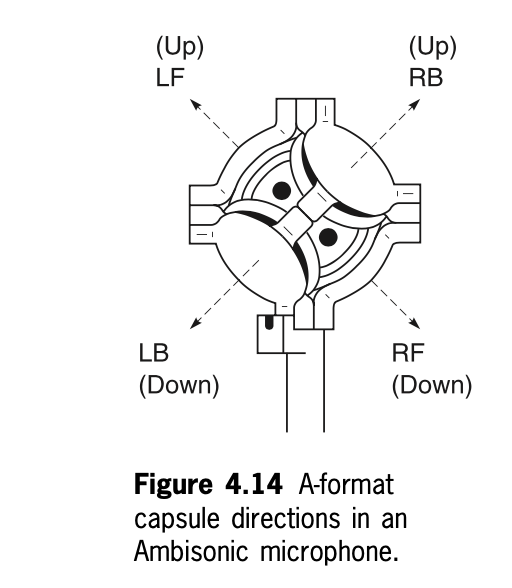
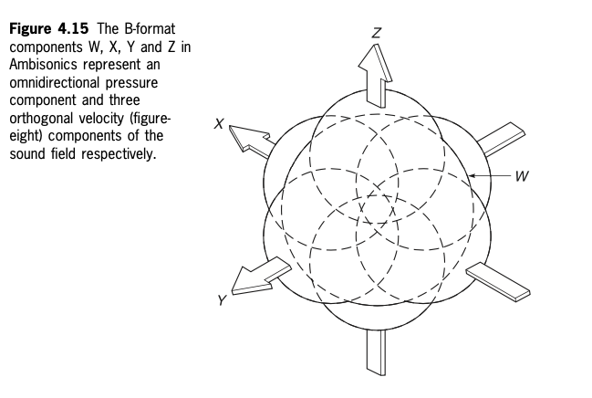
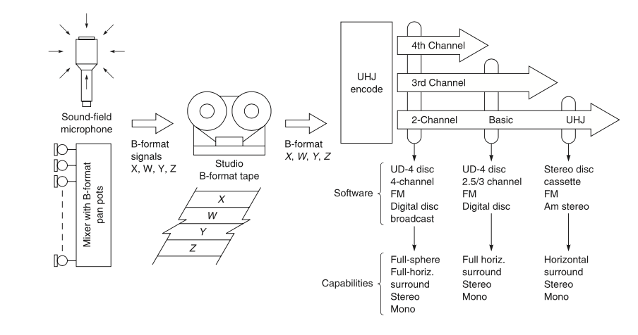
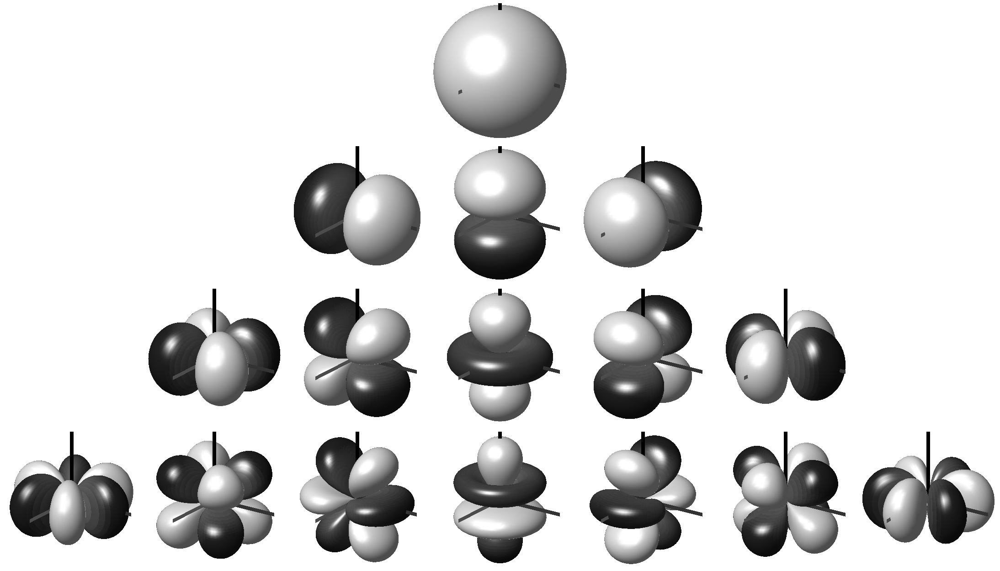

+++
title = "Ambisonics Introduction"
outputs = ["Reveal"]
[reveal_hugo]
theme = "moon"
margin = 0.2
+++

# Ambisonics

---

<iframe width="560" height="315" src="https://www.youtube.com/embed/X23hZNoSkUs" title="YouTube video player" frameborder="0" allow="accelerometer; autoplay; clipboard-write; encrypted-media; gyroscope; picture-in-picture" allowfullscreen></iframe>

## <!-- TODO: add some historical stuff here -->

---

## Principles

- Gerzon, Barton, Fellgett - main theoretical basis
- hierarchical approach to directional sound recording
- formats
  - A-format: microphone recording
  - B-format: studio equipment and processing
  - C-format: transmission
  - D-format: decoding and reproduction
  - UHJ - good for mono/stereo compatibility

{}
Ambisonics aims to offer a complete hierarchical approach to directional sound pickup, storage or transmission and reproduction, which is equally applicable to mono, stereo, horizontal surround-sound, or full ‘periphonic’ reproduction including height information.

The more channels used the greater number of dimensions can be reproduced during playback.

A format known as UHJ (‘Universal HJ’, ‘HJ’ simply being the letters denoting two earlier surround sound systems), described originally by Gaskell of the BBC Research Department (Gaskell, 1979), is also used for encoding multichannel ambisonic information into two or three channels whilst retaining good mono and stereo compatibility for ‘non-surround’ listeners.

Remember that ambisonics is not limited to any specific speaker configuration. In our room we have 7.1, but it could use quad, 5.1, or more speakers.

{}

---

### Differences from stereo/quad

- Quad
  - is fixed to four speakers
  - Uses phantom images between two speakers
  - worse with off center listening
  - common "hole in the middle" problem
- Ambisonics
  - encodes from all directions, decodes to your loudspeaker setup

{}
Ambisonics however, encodes sounds from all directions in terms of pressure and velocity components, and decodes these signals to a number of loudspeakers, with psychoacoustically optimised shelf filtering above 700 Hz to correct for the shadowing effects of the head and an amplitude matrix which determines the correct levels for each speaker for the layout chosen. Ambisonics might thus be considered as the theoretical successor to coincident stereo on two loudspeakers, since it is the logical extension of Blumlein’s principles to surround sound.
{}

---

### Sources

- Ambisonic microphone: Zoom H3-VR, Soundfield etc.
- Virtual source

{}
The source of an ambisonic signal may be an ambisonic micro- phone such as the Calrec Soundfield, described in Chapter 7, or it may be an artificially panned mono signal, split into the correct B-format components (see below) and placed in a position around the listener by adjusting the ratios between the signals. Good introductions to the subject of mixing may be found in Daubney (1982) and Elen (1983).
{}

---

### Signal formats - A format

{}
Remember there are four basic signal formats for ambisonics, a, b, c and d.

The A-format consists of the four signals from a microphone with four sub-cardioid capsules orientated as shown in Figure 4.14 (or the panpot equivalent of such signals).

The capsules are mounted on the four faces of a tetrahedron and match to left-front (LF), right-front (RF), left-back (LB) and right-back (RB), although two of the capsules point upwards and two point downwards.
{}

---

### B format

{}
The B-format consists of four signals that between them represent the pressure and velocity components of the sound field in any direction, as shown in Figure 4.15. It can be seen that there is a similarity with the sum and difference format of two channel stereo, described earlier, since the B-format is made up of three orthogonal figure-eight components (X, Y and Z), and an omni component (W).

See if you can pick out the three figure of 8 polar patterns and the one omni pattern.

W, X, and Y provide the horizontal spatial information and Z provides the height information.

X - forward-facing figure-eight (equivalent to M in MS stereo), Y is equivalent to a sideways-facing figure-eight (equivalent to S in MS stereo).

The zoom recorder can record directly to B-format with either FuMa or AmbiX or in A-Format. If we record in FuMa an encoding process is not necessary.
{}

---

### A to B Conversion

- X = 0.5((LF – LB) + (RF – RB))
- Y = 0.5((LF – RB) – (RF – LB))
- Z = 0.5((LF – LB) + (RB – RF))
- W = 0.5(LF + LB + RF + RB)

---

### C format - aka UHJ

{}
The C-format consist of four signals L, R, T and Q, which conform to the UHJ hierarchy, and are the signals used for mono or stereo-compatible transmission or recording. The C-format is, in effect, a useful consumer matrix format.

UHJ Allows us to listen to ambisoncis on stereo loudspeakers. In the ATK we can use the UHJ decoder as we have seen previously.
{}

---

### D format - reproduction

- Speaker numbers
  - Four speakers give adequate surround sound
  - six provide better immunity against the drawing of transient and sibilant signals towards a particular speaker
  - eight may be used for full periphony with height.

{}
D-format signals are those distributed to loudspeakers for reproduction, and are adjusted depending on the selected loudspeaker layout.

They can come from B or C formats. Remember that the number of speakers is unlimited in theory and not constrained to predetermined setups like quad, 5.1 etc.
{}

---

### Higher order Ambisonics

{}
The incorporation of additional directional components into the Ambisonic signal structure can give rise to improved directional encoding that covers a larger listening area than first order Ambisonics.

Visual representation of the Ambisonic B-format components up to third order. Dark portions represent regions where the polarity is inverted. Note how the first two rows correspond to omnidirectional and figure-of-eight microphone polar patterns.
{}
