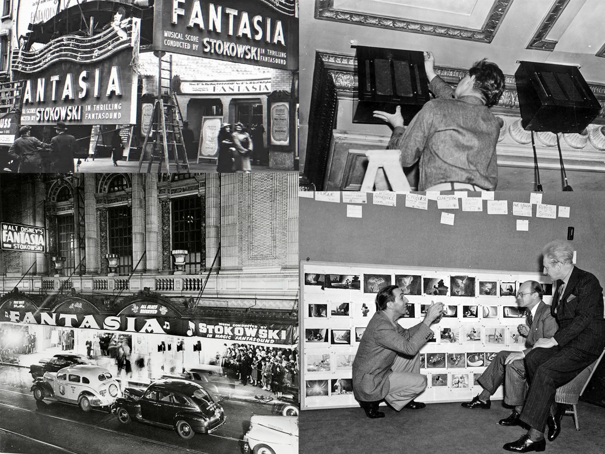
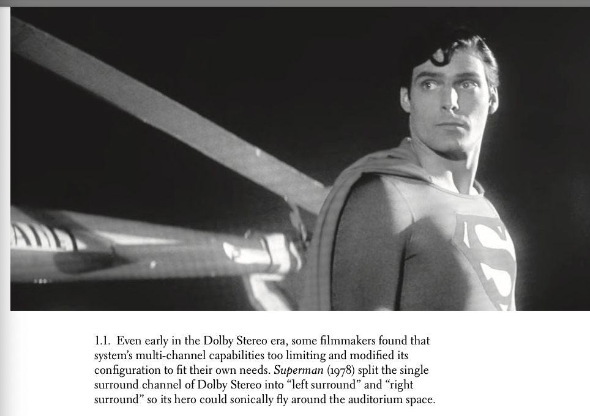
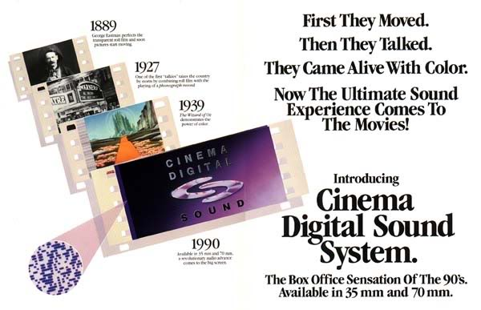
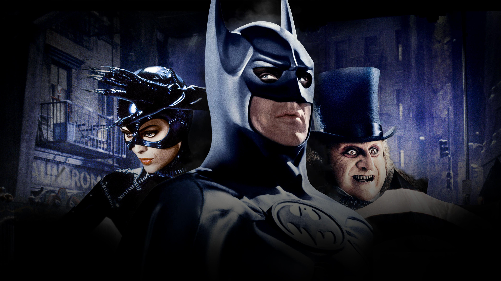
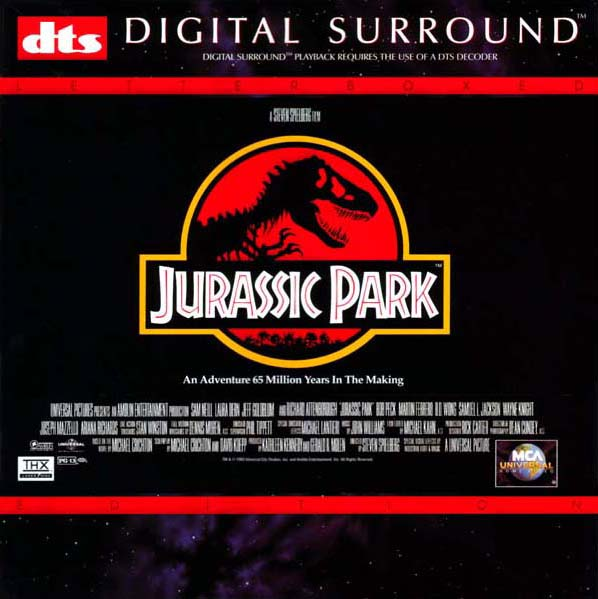
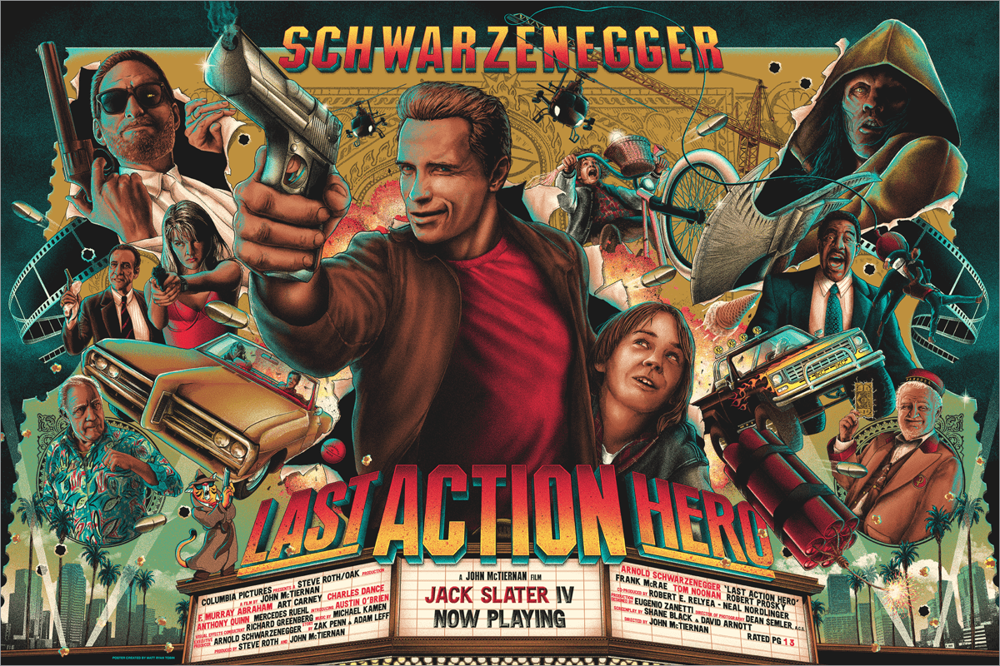

+++
title = "Production and Style"
outputs = ["Reveal"]
[reveal_hugo]
theme = "moon"
margin = 0.2
+++

> It was at the 1987 October SMPTE meeting. People were saying, “How many channels should there be [in the digital sound standard for cinema]?” And people said two . . . people said four . . . one said eight. And I put my hand up and said, “five point one.” Everybody went, “What is he talking about?”
>
> -- <cite>Tomlinson Holman, audio engineer and inventor of THX</cite>

---

## Cinema's Hidden Multi-Channel History and the Origins of Digital Surround

{}
Today, digital “5.1” sound—the “5” referring to the configuration’s five full-range channels and the “.1” to its bass-frequencies-only low-frequency effects (LFE) channel—is commonplace is homes and nearly ubiquitous in theaters. But in the late 1980s, when Holman made his proposal to the Society of Motion Picture and Television Engineers (SMPTE), no one was sure what form cinematic digital sound would take or how successful it would be. The movie industry, after all, had a long history of introducing new sound technologies only to quickly discard them.

What are the ramifications of that decision to go with 5.1 instead of one of the alternatives?

Today we'll talk about te events and technologies that lead to this standard. This history splits up into 4 parts:

1. a history of multi-channel sound in cinema to show where digital surround sound get inspiration from other systems
2. An overview of Dolby Stereo, what came right before DSS, covering its strengths and weaknesses
3. A look at the companies, technologies, and outside factors involved in the launch of DSS
4. And finally a look at the limitations of this standard to help explain the development from DSS into Atmos.

{}

---

## The Origins of Multi-channel

{}
What might seem like a seamless progression from mono -> stereo -> quad -> 5.1 is actually an intricate history of success and failure, progress and regression. This development was not only driven by advancements in technology, but also by aesthetic practices, the economics of the film industry, audience/consumer expectations, and the growth of the home market.
{}

---

## Multi-track history

- 1879: Graham Bell
- 1927: _The Jazz Singer_
- 1928: Bell Labs
- 1932: Bell Labs - first "stereo" recording
- 1933: Bell Labs - three-channel orchestral mix LCR
- 1937: first documented presentation of multi-channel audio synched to film
- 1940: Fantasia - first true multi-channel sound film

{}
1879 - Multi-channel sound as a concept actually predates cinema by 16 years, to Alexander Graham Bell's experiments with two-channel sound over telephones in 1879. He called these "stereophonic telephony"; Going into the experiments, Bell’s hypothesis was that a stereophonic telephone would provide for directional hearing more like “that experienced by direct audition” (1880: 170). Bell discovered precisely the opposite. (source: Living Stereo)

**1927** - First multi-track recordings for cinema - _The Jazz Singer_

**1928** - Bell Labs recorded an orchestra onto a disk using two separate tracks—instead of using the two tracks to record sounds from two different microphones, though, this design split the signal from one microphone, putting the high-frequency component of the sound on one track and the low frequencies on another to improve the sound quality.

**1932** - Bell Labs made another two-track recording, this time using two distinct audio channels; this 1932 record is the first known example of a true “stereo” recording.

**1933** - during this broadcast the researchers concluded that " at while an infinite number of front loudspeaker channels was desirable, left, center, and right loud- speakers were a “practical” approach to representing an infinite number."(Holman) The center speaker here overcoming the "hole in the middle" effect. This arrangement gave a pleasing result for an orchestral recording, but left a question: what was the best way to utilize a multi-channel configuration as part of a motion picture?

**1937** - the first documented presentation of multi-channel audio synched to film; Bell Labs paired a three-channel frontal sound mix with visuals for three scenes, each of which employed the multi-channel soundtrack in a different way.

These three models correspond, respectively, to multi-channel being used

1. to match a sound to its source’s (horizontal) position in the visual field,
2. to heighten the “spectacle” of the film by calling attention to a moving sound, and
3. to create a narrative space. This first test of cinematic multi-channel thus presciently included the three most common uses to which multi-channel would be put over the years.

**1940** - Fantasia - spread three speakers horizontally behind the screen to allow sound to come from multiple places across the width of the image, it fed those three speakers from three different recorded channels. Second, the Los Angeles premiere of the film saw the use of a “surround channel,” with ninety-six smaller speakers around and behind the audience coming to life for specific sound effects and for the sound of a large chorus singing at the end of the film.

{}

---

{}
The film’s multi-channel mix itself was a hybrid between “correct” spatial reproduction of the orchestral recordings that dominated the musically driven film (Beck’s “binaural model”) and a more “spectacular” approach (Beck’s “stereophonic model”) that moved sounds out of their orchestral configuration when doing so might be more engaging for the audience.

The finished movie featured three channels of optical sound and one control track on one strip of 35mm film and the image on another—theaters using Fantasound thus needed to have two linked projectors kept in exact synchronization.
{}

---

## Widescreen Rejuvenates Surround

{}
Two advances in technology would further the cause of multi-channel sound: better loudspeakers utilizing permanent magnets (developed as part of the war effort) and magnetic audio recording tape (a German invention obtained by the Allies during their offensive into Germany)

Various experiments in multi-channel sound would happen during this time but none would catch on.

After the demise of multi-channel in mainstream 35mm presenta- tion, monophonic optical sound once again dominated, and theatrical sound systems would remain unchanged through the 1960s and most of the 1970s.
{}

---

## Dolby Standardizes Surround

{}
Cinema sound quality diminished during the 1960s-70s causing a decrease in audience attendance. This coincided with an improvement with an increase in the quality of home audio systems. IN the beginning of the 70s movies studios began to try to draw audiences back by improving audio quality.
{}

---

## Earthquake (1974)

<iframe width="560" height="315" src="https://www.youtube.com/embed/xJlnv-5QId8" title="YouTube video player" frameborder="0" allow="accelerometer; autoplay; clipboard-write; encrypted-media; gyroscope; picture-in-picture" allowfullscreen></iframe>

{}
Universal Studios premiered its Sensurround system with the disaster film Earthquake. Like the widescreen and multi-channel processes of the 1950s, Sensurround attempted to draw patrons to movie theaters with promises of “technology impossible to duplicate at home." Sensurround was used to create powerful ultra-low-frequency rumbles (some below the limits of human hearing) that shook audiences and theaters in concert with explosions and other appropriate onscreen stimuli (like Earthquake’s titular event). It also used a control track to “steer” other sounds to the Sensurround speakers to create a more “enveloping” sense of destruction. Released in monophonic and multi-channel magnetic (four- track 35mm and six-track 70mm) versions that could function either with or without the Sensurround equipment, Earthquake screenings employed anywhere from one to seven separate audio and Sensurround channels, depending on the theater.

This system was monophonic however and had limitations. It also ran on proprietary Universal studios equipment.

The system remains noteworthy, however, for its use of a discrete low-frequency-only channel, an idea that would resurface a decade later as part of the digital surround sound specifications.
{}

---

## Dolby Stereo

{}
Dolby Stereo used matrixing to encode four channels (three front, one sur- round) into two. It also incorporated noise reduction technology into the encoding process to give its optical soundtracks wider frequency and dynamic ranges than their monophonic counterparts.

Dolby used a traditional optical soundtrack, taking advantage of matrixing and noise reduction to fit the (encoded) data for four tracks into the same area of the print that the monophonic soundtrack had traditionally occupied. Thus film prints with Dolby Stereo could be made for the same price as those with mono sound and would even play back on mono projectors.

Drawbacks:

- Dolby’s matrixing setup offered limited mixing possibilities compared
- In response to the negative audience reactions encountered by multi- channel dialogue and effects in the 1950s, Dolby’s matrix emphasized the front center channel as the source of most sounds—indeed, the original Dolby Stereo system did not even provide for a surround chan- nel, and when one was finally added it had only about half the frequency range of the front channels.
- to ensure backward compatibility with monophonic theaters, no sounds crucial to a film could be encoded in the surround channel, as Dolby’s matrixing process ensured they would vanish upon playback in a mono theater.

The success of this format was driven by the sound-intensive films that followed closely after it's introduction:

1977’s Star Wars. The opening scene, where a giant spaceship audibly travels from the back of the theater to the front, showcased the powerful capabilities of the new audio format and catapulted Dolby Stereo into the public consciousness.57 The wild success of Dolby Stereo films such as Star Wars showed exhibitors that audiences noticed quality sound, and they rushed to install Dolby’s system in their theaters. Less than three years after Star Wars premiered, the Dolby Stereo format had already been used on 85 feature films, and decoding equipment had been installed in over 1,200 theaters.

And as we saw earlier in the semester other films help to popularize the format, and added their own technological additions, such as a dedicated subwoofer track (1977’s Close Encounters of the Third Kind) or stereo surrounds (1978’s Superman). Apocalypse Now (1979), which birthed the term “sound designer,” even used an entirely different multi-channel configuration that more closely resembled Quintaphonics but was marketed simply as Dolby Stereo.
{}

---

### The problem of dolby stereo

{}
Dolby Stereo deserves credit for being the first format to supplant monophonic optical sound as a viable standard for theatrical exhibition. And to be sure, it represented a significant improvement over the status quo: it offered cinema improved dynamic and frequency ranges and “cleaner” sound—capabilities further enhanced in the 1980s by Dolby SR (Spectral Recording, a noise reduction format), which applied improved noise reduction techniques to the Dolby Stereo matrix.

The standard was not perfect, but it was a standard, so was successful.

Dolby Stereo remains important even today—all 35mm film releases include a Dolby Ste- reo track for backward compatibility with the few remaining theaters without digital sound systems and to serve as a backup to the digital soundtracks for those theaters with digital systems installed.

**Circumvent the standard**

1977’s Close Encounters of the Third Kind, 1978’s Superman, and 1979’s Apocalypse Now.

Stanley Kubrick ultimately found playback of matrixed sounds so unpredictable that he chose to continue making his films in mono throughout the era of Dolby Stereo’s dominance
{}

---

> [Quad can] create the illusion of a sound moving in all four quadrants of the room. Mono surround, 35mm Dolby optical, pretty much ties you to the idea of some mixture of front and back. Since quadraphonics gives you a left back and a right back, you can steer that sound through 360 degrees.
>
> -- Walter Murch

---

> of the “emergence” of a new sound aesthetic in the use of [Dolby Stereo] ambience hides the fact that no other aesthetic could possibly have emerged simply because of the system’s design. The screen centrality and the lack of divergence inherent in Dolby Stereo ensured that all dialogue and main sound effects would be channeled to the screen speakers and not the surrounds.
>
> -- Jay Beck

{}
While the surround channel offered the ability to place sounds around the audience, the system actually reinforced and codified the norms of mono- phonic, screen-centric cinema rather than opening up the possibilities of what full-fledged surround could do. Dolby’s monophonic-based conception of how multi-channel “should” be used and the technical limitations of the Dolby Stereo matrix, rather than filmmakers’ wishes, would continue to dictate sound design practices through the 1980s and early 1990s.
{}

---

## Digital Surround's Pre-history

---

## SMPTE Digital Sound Standard

1. any digital multi-channel system should use fully discrete channels rather than matrix encoding to avoid encountering Dolby Stereo’s problems with sounds not playing back in the correct channels.
2. the new digital system should have at least CD-quality sound so that cinematic systems could catch up with home audio.

{}
Many filmmakers looked forward to the advances in digital filmmaking as a way to fix the issues with Dolby Stereo. Although tests with digital sound for cinema happened in the 1970s they were not successful enough for use in the practical cinema sound system. By 1987, digital technology had advanced enough that SMPTE began to work on a digital sound standard for film with two objectives in mind:

1. any digital multi-channel system should use fully discrete channels rather than matrix encoding to avoid encountering Dolby Stereo’s problems with sounds not playing back in the correct channels.
2. that the new digital system should have at least CD-quality sound so that cinematic systems could catch up with home audio.

What remained to be determined was the number of channels the new standard would require...Ultimately, after Holman explained to everyone what a “tenth” of a channel was, his “5.1”-channel configuration was agreed upon as the minimum standard for digital surround sound systems.

Here he explained that the .1 is because the LFE has a 10th of the range of the other speakers.
{}

---

### LFE Channel

<iframe width="560" height="315" src="https://www.youtube.com/embed/-Rv9_ZCcp9I" title="YouTube video player" frameborder="0" allow="accelerometer; autoplay; clipboard-write; encrypted-media; gyroscope; picture-in-picture" allowfullscreen></iframe>

{}
While it may seem curious to dedicate an entire channel to low frequencies, two physical laws make this a useful design.

1. it takes considerably more raw sound energy for a low-frequency sound to reach a given loudness level than it does for a higher frequency one73—a good example of this is Jabba the Hutt’s deep bass voice in Return of the Jedi (1983), which carries much more acoustic energy (and uses almost all the available amplitude of the optical soundtrack) than the other characters’ “normal” frequency voices, yet does not sound much louder.74 The LFE channel allows soundtracks to provide the same range of volumes to low-frequency sounds as they do to higher- frequency ones.
2. the human ability to localize sound is much weaker at low frequencies; below roughly 80 Hz, sounds simply cannot be located with any accuracy at all. A single LFE channel thus serves the dual function of creating “enveloping” bass sound and giving added emphasis to localized sounds coming from any of the full-range channels, as the human brain uses higher-frequency sounds and onscreen visual cues to “localize” sounds coming from the LFE channel.

{}

---

- Criteria for success of a new standard
  - it would have to be as robust and manageable as the system it replaced.
  - it would have to be backward compatible with existing analog sound systems.
  - it would have to be cost effective

{}
This last criterion was particularly critical: a major reason Dolby Stereo was so successful despite its matrix encoding scheme was that it had no economically viable competition, as no one had been able to devise a non-matrixed method for fitting more than two channels onto 35mm film without using (expensive) magnetic striping.
{}

---

### Cinema Digital Sound (CDS)

{}
The importance of meeting these three practical requirements was aptly demonstrated by the failure of the first digital sound system to make it to market—which met none of them. Cinema Digital Sound, or CDS, was a joint venture between Eastman Kodak and Optical Radiation Corporation and hoped to win market share by beating its competitors (including Dolby) to the playing field. In this respect its plan worked: CDS was the first digital sound system to be used on a major release, with a number of 70mm prints of 1990’s Dick Tracy employing a 5.1-channel CDS soundtrack.77 The Dick Tracy screenings went smoothly, but CDS’s second appearance two weeks later, with the big-budget Tom Cruise vehicle Days of Thunder (1990), was an unmitigated disaster. At the film’s Hollywood premiere, featuring a 70mm print with a CDS digital soundtrack, the processor used to decode the soundtrack overheated and started a fire in the projection room. Obviously the industry bigwigs present were not impressed— “this town is not too forgiving of that,” as Dolby consultant Thom Ehle noted—and the system was used on less than ten films after Days of Thunder.
{}

---

### Digital Sound arrives in Triplicate

{}
Dolby SR-D and the other two digital sound systems (DTS and SDDS) that soon followed were successful in large part because unlike CDS, they had been developed with an eye to the practical concerns of robustness, backward compatibility, and economic viability.

To further ease exhibitors’ concerns about robustness, all post-CDS digital systems kept the analog Dolby Stereo track in its traditional place and designed their systems such that in the case of any problem with the digital soundtrack during projection, playback would simply revert to the Dolby Stereo system. Thus the worst-case scenario would be not the “no sound at all” of a failing CDS system, but the four-channel-matrixed Dolby Stereo sound to which audiences were already accustomed. Keeping the Dolby Stereo track in place also ensured backward compatibility and eliminated concerns about maintaining dual print inventories.
{}

---

### Dolby SR-D (1992)

{}
When Dolby’s SR-D format premiered in 1992, the San Francisco Chronicle called the system “a significant breakthrough in sound,”84 and audiophile magazine Stereo Review described it as “a precursor of and foundation for future home media” that would affect “all of audio, or very close to that.”85 Despite these rave reviews, SR-D’s debut went largely unnoticed by the general public. Even the ads for Batman Returns mentioned nothing about the new sound system.

Not many theatres had the system because of it's price retrofitting an existing theater with SR-D cost around $20,000 at the time, and with SR-D-encoded prints backward compatible with analog systems, most theaters chose to use Batman Returns’s Dolby Stereo soundtrack rather than pay for the new system.
{}

---

### DTS (1993)

{}
This high cost of adoption kept Dolby’s system from spreading quickly enough to keep competitors out of the market. A year after SR-D’s introduction, the DTS system developed by Digital Theater Systems debuted in Jurassic Park (1993). But where only a handful of the theaters showing Batman Returns had installed Dolby’s digital system, Jurassic Park opened in over a thousand DTS-equipped theaters, so that about 80 percent of the movie’s American audience heard it in DTS.

two reasons for success:

1. exhibitors could purchase DTS’s system for about $4,000, a mere fifth the cost of adopting Dolby’s SR-D
2. Dolby needed to convince studios and filmmakers to embrace its system, while DTS already had the weight of an entire studio and one of the most successful directors of all time behind it.

{}

---

### SDSS (1993)

{}
Sony’s Sony Dynamic Digital Sound (SDDS), which debuted in Last Action Hero (1993).92 Sony’s system added two more full-range channels behind the screen to the 5.1 minimum specified by the SMPTE standard and adopted by SR-D and DTS, resulting in a 7.1-channel setup with five front channels and two surrounds.
{}

---

### Success of DSS

> The word “digital” is to this decade as “transistor” was to the Fifties and Sixties, with implications and resonances that reach beyond the specific technology it names. It gleams with the promise of a cleansed, transformed future, of something new under the sun and better on the horizon.
>
> Stereo Review - 1992

{}
This trend was not lost on the creators and marketers of DSS systems. Shortly after the debut of Dolby’s new system, its name was changed from “Dolby SR-D,” a label intended to exploit the industry’s familiarity with Dolby SR, to “Dolby Digital.” Upon its introduction a year later, DTS showed it had learned from Dolby’s initial marketing error by adopting for its own logo a shiny disc with “the digital experience” (emphasis in original) emblazoned across it—a marketing image allying DTS not just with the buzzword “digital” but also with the compact disc, the hot consumer technology of the day.
{}

---

<!-- TODO: 45-52 -->

### Surround Sound Moves to the Home

---

### Variations in 5.1 Configurations

---

### The Future of Digital Surround Technologies
